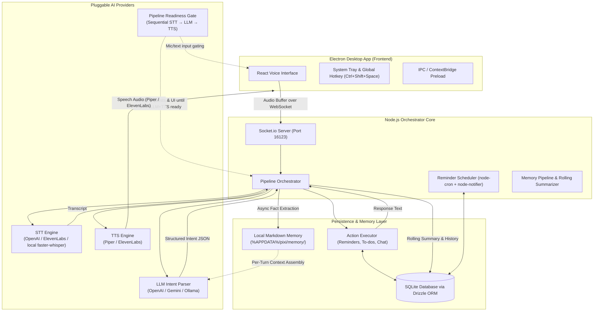

# pixi — System Architecture

**pixi** is a modular, voice-activated Windows desktop assistant designed with Electron, React, TypeScript, SQLite, Local Markdown Memory, and a pluggable AI provider architecture (STT, LLM, TTS).

---

## 1. High-Level System Architecture



---

## 2. Core Subsystems

### A. Main Desktop Process & Window Management ([src/main/index.ts](file:///c:/Users/kapil/Desktop/space/pixi/src/main/index.ts))
- **Tray & Global Hotkey**: Registers Windows System Tray icon and `Ctrl+Shift+Space` global shortcut to toggle the floating voice window.
- **IPC Isolation**: Uses Electron `contextBridge` ([src/main/preload.ts](file:///c:/Users/kapil/Desktop/space/pixi/src/main/preload.ts)) to separate secure native Node APIs from the web renderer.

### B. Voice Interface & Renderer ([src/renderer/index.tsx](file:///c:/Users/kapil/Desktop/space/pixi/src/renderer/index.tsx))
- **Audio Capture**: Utilizes browser `navigator.mediaDevices.getUserMedia` and `MediaRecorder` API to record voice input into WAV chunks.
- **WebSocket Streaming**: Streams binary audio data over Socket.io to the orchestrator.

### C. Pipeline Orchestrator ([src/orchestrator/index.ts](file:///c:/Users/kapil/Desktop/space/pixi/src/orchestrator/index.ts))
The central engine that manages the end-to-end pipeline execution:
1. Receives audio buffer from socket.
2. Invokes **STT** provider to convert audio into text (`transcribe`).
3. Passes transcript to **LLM** provider to parse into structured intent (`parseIntent`).
4. Executes the intent via **Action Executor** (`executeIntent`).
5. Invokes **TTS** provider to synthesize speech output (`speak`).
6. Dispatches non-blocking asynchronous fact extraction and rolling conversation summaries.

### D. Pipeline Readiness Gate ([src/providers/readiness.ts](file:///c:/Users/kapil/Desktop/space/pixi/src/providers/readiness.ts))
The three provider stages are **not independent at startup** — they are gated by a single shared, ordered readiness module that all consumers (orchestrator requests, reminder scheduler, renderer UI) consult instead of probing services separately:

1. **Sequential evaluation order**: STT → LLM → TTS. A stage is only reported ready after every earlier stage is ready; progress of later stages stays at 0 until the blocking stage completes.
2. **First-run setup runs in the same order**: Step 1/3 Whisper STT (binary + model) → Step 2/3 Ollama LLM (service + model pull) → Step 3/3 Piper TTS (binary + voice), each fully completing before the next begins.
3. **Single source of truth**: a cached snapshot (2s background watcher) with change listeners; the Electron main process pushes flips to the renderer (`pipeline:readiness`) so the mic, wake-word/VAD, and text input are disabled until the gate opens.
4. **Provider-aware**: cloud stages (OpenAI/Gemini/ElevenLabs keys) auto-pass; local assets (Whisper/Ollama/Piper) are only required in offline mode.
5. **Scheduler integration**: reminders due before the gate opens show a notification only after readiness and stay pending for retry (no TTS before Piper exists).

### E. Pluggable Providers ([src/providers/](file:///c:/Users/kapil/Desktop/space/pixi/src/providers))
Each AI task is decoupled into independent provider interfaces with automatic fallback:

| Provider Type | Supported Engines | Automatic Fallback |
|---|---|---|
| **Speech-to-Text (STT)** | OpenAI Whisper, ElevenLabs Scribe, local `faster-whisper` / `whisper-cli` | Local `faster-whisper` server / `whisper-cli.exe` |
| **Intent Model (LLM)** | OpenAI (`gpt-4o-mini`), Google Gemini, Ollama | Local Ollama (`llama3.2:3b`) |
| **Text-to-Speech (TTS)** | Local Piper TTS, ElevenLabs | Local Piper TTS (`piper.exe`) |

### F. Local Memory & Persistence ([src/memory/](file:///c:/Users/kapil/Desktop/space/pixi/src/memory))
- **Per-Turn Context Assembly ([`src/memory/context-pipeline.ts`](file:///c:/Users/kapil/Desktop/space/pixi/src/memory/context-pipeline.ts))**: Assembles permanent profile (`profile.md`), keyword-retrieved memories (`preferences`, `routines`, `projects`, `people`), active session summaries, and recent raw messages into LLM prompts.
- **100% Local Markdown Memory ([`src/memory/markdown-memory.ts`](file:///c:/Users/kapil/Desktop/space/pixi/src/memory/markdown-memory.ts))**: Human-readable Markdown files stored locally in `%APPDATA%\pixi\memory\` with YAML frontmatter.
- **Asynchronous Fact Extraction ([`src/memory/fact-extractor.ts`](file:///c:/Users/kapil/Desktop/space/pixi/src/memory/fact-extractor.ts))**: Non-blocking background worker that extracts durable user facts, preferences, and routines into Markdown memory files without adding turn latency.
- **Rolling Summaries & Compaction ([`src/memory/rolling-summary.ts`](file:///c:/Users/kapil/Desktop/space/pixi/src/memory/rolling-summary.ts))**: Automatically compresses older turns into running session summaries stored in SQLite and archives raw messages to `.jsonl.gz`.

### G. Action Executor & Storage ([src/actions/](file:///c:/Users/kapil/Desktop/space/pixi/src/actions) & [src/db/](file:///c:/Users/kapil/Desktop/space/pixi/src/db))
- **Action Executor**: Takes validated intent JSON (e.g. `reminder.create`, `todo.create`, `chat.respond`) and performs the underlying operations.
- **Database**: Local SQLite database using `better-sqlite3` and `drizzle-orm` storing `reminders` and `todos` tables.

### H. Background Scheduler ([src/orchestrator/scheduler.ts](file:///c:/Users/kapil/Desktop/space/pixi/src/orchestrator/scheduler.ts))
- Runs background cron jobs to check for due reminders in SQLite.
- Triggers native Windows desktop notifications via `node-notifier` and speaks alert text via TTS.
- **Readiness-gated**: spoken reminder delivery is skipped (and the reminder left pending for retry) until the pipeline readiness gate reports STT → LLM → TTS all ready.

---

## 3. End-to-End Voice & Memory Request Sequence

```mermaid
sequenceDiagram
    autonumber
    actor User
    participant Renderer as React Renderer
    participant Orch as Node Orchestrator
    participant STT as STT Provider
    participant LocalMem as Local Markdown Memory
    participant LLM as LLM Provider
    participant Exec as Action Executor
    participant DB as SQLite DB
    participant TTS as TTS Provider

    Note over User, TTS: Phase 1: Voice Request Execution
    User->>Renderer: Click mic / Speak command
    Renderer->>Orch: socket.emit('audio', wavBuffer)
    Orch->>STT: transcribe(wavBuffer)
    STT-->>Orch: { text: "Remind me to call Mom tomorrow at 10am" }
    Orch->>Renderer: socket.emit('transcript', { text })
    LocalMem-. Assembled Context (Profile + Memory + History) .->Orch
    Orch->>LLM: parseIntent(text, context)
    LLM-->>Orch: { intent: "reminder.create", params: { text: "call Mom", due: "..." } }
    Orch->>Exec: executeIntent(intent)
    Exec->>DB: INSERT INTO reminders ...
    DB-->>Exec: Created ID
    Exec-->>Orch: { spoken: "Reminder set for 10am: call Mom", display: "..." }
    Orch->>Renderer: socket.emit('response', response)
    Orch->>TTS: speak("Reminder set for 10am: call Mom")
    TTS-->>User: Audio playback (Piper / ElevenLabs)

    Note over Orch, DB: Phase 2: Async Fact Extraction & Rolling Memory Consolidation
    Orch--)LocalMem: Async non-blocking fact extraction (extractFacts)
    Orch--)DB: Save turn to SQLite & trigger rolling summary check
```

---

## 4. Directory Map

```text
pixi/
├── assets/                  # App icons and media assets
├── src/
│   ├── actions/             # Business logic handlers for intents (reminders, todos, chat)
│   ├── db/                  # SQLite schema definitions and Drizzle ORM operations
│   ├── main/                # Electron main process (tray, windows, shortcuts, IPC preload)
│   ├── memory/              # Local Markdown memory, fact extraction, context assembly & rolling summary
│   ├── orchestrator/        # Socket.io pipeline coordinator & cron scheduler
│   ├── providers/           # Decoupled STT, LLM, and TTS provider implementations
│   ├── renderer/            # React user interface components & audio recording hook
│   └── shared/              # Zod config validation, types, and HTTP helpers
├── index.html               # Main HTML entry template
├── tsup.config.ts           # Dual-target build configuration (Node main + Browser IIFE)
└── package.json             # NPM dependencies and scripts
```

---

## 5. Step-by-Step Pipeline Latency Breakdown

The voice pipeline executes in a modular, streaming sequence. Below is the latency benchmark breakdown for each component step:

| Pipeline Step | Provider / Component | Expected Latency | Description |
|---|---|---|---|
| **1. Voice Activity & Pause Detection (VAD)** | Client AudioWorklet / ScriptProcessor | **0ms – 2,000ms** | Detects vocal energy RMS (`> 0.015`). Automatically triggers auto-send to LLM after **2 seconds of continuous silence** following speech. |
| **2. Client Audio Encoding (PCM to WAV)** | Renderer [`encodeWav`](file:///c:/Users/kapil/Desktop/space/pixi/src/renderer/index.tsx) | **10ms – 30ms** | Packs Float32Array PCM chunks into 16kHz mono WAV audio buffer. |
| **3. IPC & Socket.io Transport** | Localhost Socket.io Bridge (Port 16123) | **2ms – 5ms** | Binary buffer transport from Electron renderer to Node.js orchestrator. |
| **4. Speech-to-Text (STT) Transcription** | OpenAI Whisper (`whisper-1`) | **400ms – 800ms** | Standard OpenAI cloud transcription. |
| | ElevenLabs Scribe (`scribe_v1`) | **250ms – 500ms** | Low-latency cloud audio transcription. |
| | Local `faster-whisper` Server / `whisper-cli` | **200ms – 500ms** | Offline GPU/CPU Whisper model transcription. |
| **5. Context Injection & LLM Intent Parsing** | Google Gemini (`gemini-1.5-flash`) | **250ms – 500ms** | Gemini fast intent parsing. |
| | OpenAI (`gpt-4o-mini`) | **300ms – 600ms** | OpenAI fast intent parsing. |
| | Local Ollama (`llama3.2:3b`) | **400ms – 1,000ms** | Fully offline local model intent extraction. |
| **6. Intent Action Execution & DB Storage** | SQLite (`better-sqlite3` + Drizzle) | **1ms – 5ms** | Instant local database CRUD query execution (reminders, to-dos, chat handler). |
| **7. Text-to-Speech (TTS) Synthesis** | Local Piper TTS (Offline Neural ONNX) | **50ms – 150ms** | Immediate offline neural speech synthesis. |
| | ElevenLabs | **350ms – 700ms** | Cloud neural audio synthesis & MP3 streaming. |
| **8. Audio Playback & Renderer Response Event** | Electron Window / Audio Engine | **2ms – 10ms** | Socket response payload emission and audio playback start. |

### End-to-End Latency Benchmarks (Silence Cutoff to Spoken Response)
- **Fastest Offline Configuration (Local STT + Local LLM + Piper TTS)**: **~400ms – 800ms total turn latency**
- **Optimal Cloud Configuration (OpenAI STT + Gemini LLM + Piper TTS)**: **~450ms – 900ms total turn latency**
- **Full Cloud Configuration (OpenAI STT + OpenAI LLM + ElevenLabs TTS)**: **~1.1s – 1.9s total turn latency**
